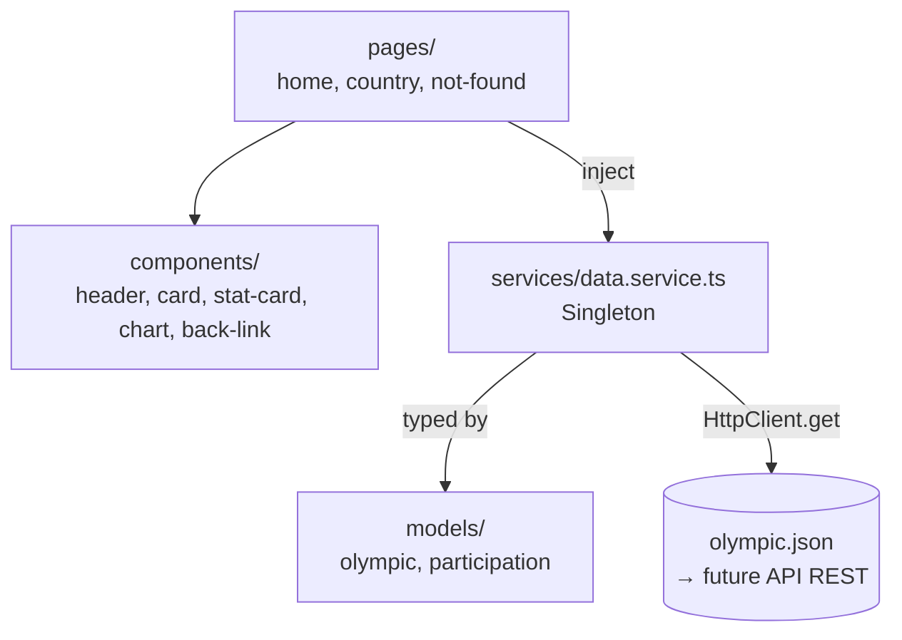

# Notes d'architecture du projet Télésport

Ce fichier liste les points à améliorer sur ce projet avant l'ajout de nouvelles fonctionnalités.

## Résumé

| ✅ | Point | Catégorie | Priorité |
|---|---|---|---|
| [ ] | [Version Angular obsolète](#version-angular) | Sécurité | Haute (mais hors périmètre du cours) |
| [x] | [`NgModule`s à la place des composants standalone](#ngmodules-vs-standalone) | Structure | Moyenne |
| [x] | [Injection par constructeur plutôt que `inject()`](#inject-function) | Structure | Basse |
| [x] | [Classes CSS utilitaires trop responsables](#css-responsabilites) | Structure | Moyenne |
| [x] | [Manque de composants atomiques](#composants-atomiques) | Duplication | Haute |
| [x] | [Usage massif de `any`, absence de modèles](#typescript-any) | Typage | Haute |
| [x] | [Absence de couche service](#absence-service) | Duplication | Haute |
| [x] | [Mauvaise utilisation de RxJS](#mauvaise-utilisation-rxjs) | Qualité | Basse |
| [x] | [`console.log` de débug oubliés](#console-log) | Sécurité | Haute |
| [ ] | [Aucune gestion réelle des erreurs](#gestion-erreurs) | Structure | Haute |
| [x] | [Absence de linter](#absence-linter) | Qualité | Moyenne |
| [] | [Tests unitaires non implémentés](#tests-non-implementes) | Qualité | Moyenne |
| [x] | [URL en dur plutôt qu'en variable d'environnement](#url-en-dur) | Placement | Haute |
| [x] | [Hiérarchie des titres incohérente](#uxui-titres) | UX/UI/A11y | Basse |
| [x] | [Header non partagé entre les pages](#uxui-header) | UX/UI/A11y | Haute |
| [ ] | [Absence de responsive](#uxui-responsive) | UX/UI/A11y | Moyenne |
| [ ] | [Navigation vers un pays au clavier impossible](#uxui-clavier) | UX/UI/A11y | Moyenne |
| [ ] | [Divers problèmes d'accessibilité (contraste, sémantique)](#uxui-accessibilite) | UX/UI/A11y | Moyenne |

## Détail des problèmes

<a id="version-angular"></a>
### Version Angular

La version 18 utilisée pour ce projet est obsolète et n'est plus maintenue par Angular.  
Elle présente par ailleurs de nombreuses failles de sécurité dans ses dépendances, comme l'indique le résultat de la commande `npm audit` :  
> 76 vulnerabilities (7 low, 20 moderate, 46 high, 3 critical)

**Suggestion :** il faudrait migrer au minimum vers la version 20 (encore supportée), idéalement vers la dernière version 22.  
(voir [Version compatibility • Angular](https://angular.dev/reference/versions))  

Je suppose cependant que cela est hors du cadre de ce cours.  

<a id="ngmodules-vs-standalone"></a>
### `NgModule`s utilisés à la place des composants standalone

Angular recommande l'utilisation de **composants standalone**, au lieu d'utiliser l'ancienne méthode des `NgModule`s. Le CLI Angular 18 génère d'ailleurs des composants standalone par défaut.  
La différence : chaque composant déclare directement ses propres dépendances dans son tableau `imports`, au lieu de passer par un `NgModule` central qui regroupe `declarations`/`imports`/`exports`.  
Voir la documentation officielle ([Importing and using components • Angular](https://v18.angular.dev/guide/components/importing)), qui indique :  
>  The Angular team recommends using standalone components for all new development.

Ce projet utilise encore l'ancien modèle `NgModule` :
* `app.module.ts` déclare tous les composants (`AppComponent`, `HomeComponent`, `NotFoundComponent`, `CountryComponent`) dans un unique `declarations`, et bootstrap l'app via `bootstrap: [AppComponent]` (donc `bootstrapModule`, et non `bootstrapApplication`).
* `app-routing.module.ts` utilise `RouterModule.forRoot(routes)` au sein d'un `NgModule` dédié, plutôt que la configuration standalone du router (`provideRouter`).
* Aucun composant du projet (`HomeComponent`, `CountryComponent`, `NotFoundComponent`, `AppComponent`) ne porte le flag `standalone: true` ni de tableau `imports` propre.

**Solution proposée :** suivre le guide de migration officiel Angular pour convertir l'application vers les composants standalone : [Standalone • Angular](https://v18.angular.dev/reference/migrations/standalone).

<a id="inject-function"></a>
### Injection de dépendances via le constructeur, plutôt que la fonction `inject()`

Angular 18 introduit (et recommande) la fonction `inject()`, utilisable directement dans le corps de la classe ou dans les initialiseurs de propriété, en remplacement de l'injection par paramètres de constructeur. Ce projet n'utilise que l'ancienne méthode.  

**Preuves**

```ts
// home.component.ts, ligne 19
constructor(private router: Router, private http:HttpClient) { }

// country.component.ts, ligne 21
constructor(private route: ActivatedRoute, private router: Router, private http: HttpClient) {
```

**Solution proposée :**
* Exécuter le script de migration officiel proposé par Angular : `ng generate @angular/core:inject`.

<a id="css-responsabilites"></a>
### CSS : les classes utilitaires ont trop de responsabilités (`.center`, `.split`)

Les classes `.center` et `.split`, définies globalement dans `styles.scss`, sont censées d'après leur nom être des classes utilitaires génériques mais mélangent en réalité plusieurs responsabilités : du layout (flex, centrage, gap), du style visuel (fond/bordure, couleur, border-radius) et de la typographie (règles sur les `p` imbriqués). Leur nom ne reflète pas ce qu'elles font réellement, ce qui les rend trompeuses et difficiles à réutiliser sans effets de bord.  

On en a d'ailleurs une preuve avec la classe `.center` : dans le composant `not-found`, elle est entièrement redéfinie en local, avec une signification différente (plein écran + centrage), sans reprendre le style "carte" (fond, padding, couleur) porté par la version globale.  

**Solution proposée :**
* Adopter une approche **utility-first** (façon Tailwind) : des classes utilitaires minimales, une responsabilité chacune (ex. `.d-flex`, `.m-1`, `.gap-4`, `.justify-center`, `.full-screen`), plutôt que des classes génériques qui accumulent des styles non liés.
* Extraire le pattern visuel récurrent ("carte" avec padding/border-radius, repéré à la fois dans `.center div` et `.split div`) dans un composant `card`, avec ses classes sémantiques propres (`.card`, `.card--filled`) définies au niveau du composant lui-même, et non plus dans le fichier global.
* Vérifier au cas par cas, dans chaque template, les usages actuels de `.center`/`.split` pour vérifier quelles classes utilitaires utiliser à la place.

<a id="composants-atomiques"></a>
### Manque de composants atomiques

`HomeComponent` et `CountryComponent` partagent la même structure visuelle (un titre, un bloc "chiffre clé + libellé" répété plusieurs fois, un graphique Chart.js dans un `<canvas>`), mais chacun réécrit entièrement son propre HTML/SCSS/TS pour ça, sans passer par un composant commun. Au sein de ces pages elles-mêmes, les templates HTML sont souvent dupliqués.  
Ainsi, toute modification générique doit être répercutée manuellement à de nombreux endroits, ce qui est fastidieux et présente un risque important d'incohérence ou d'oubli.  
De même si on devait créer une nouvelle page sur le même modèle (répartition des médailles par discipline et pays, par exemple), on dupliquerait à nouveau une très grande quantité de code.  

**Preuves : exemples de code dupliqué**
* Le bloc affichant un label et sa valeur associée est dupliqué 2 fois dans `home.component.html` (nombre de pays, nombre de JOs) et 3 fois dans `country.component.html` (entries, médailles, athlètes) :
```html
<div>
  <p>Label</p>
  <p>Valeur</p>
</div>
```

* La structure globale est quasiment identique entre `home.component.html` et `country.component.html` :
```html
<div>
    <div class="center">
      <div>{{ titlePage }}</div>
    </div>
    <div class="split">
      ...
  </div>
  Chart
</div>
```

* La création du graphique Chart.js est dupliquée entre `buildPieChart` (`home.component.ts`) et `buildChart` (`country.component.ts`) : même signature de méthode, même mécanique (créer un `Chart` avec un id de canvas, l'assigner à une propriété du composant, fixer `options.aspectRatio`), seuls le type de graphique, l'id du canvas et les données diffèrent :
```ts
// home.component.ts
buildPieChart(countries: string[], sumOfAllMedalsYears: number[]) {
  const pieChart = new Chart("DashboardPieChart", {
    type: 'pie',
    data: {
      labels: countries,
      datasets: [{ label: 'Medals', data: sumOfAllMedalsYears, ... }],
    },
    options: { aspectRatio: 2.5, onClick: (e) => { ... } }
  });
  this.pieChart = pieChart;
}

// country.component.ts
buildChart(years: number[], medals: string[]) {
  const lineChart = new Chart("countryChart", {
    type: 'line',
    data: {
      labels: years,
      datasets: [{ label: "medals", data: medals, ... }],
    },
    options: { aspectRatio: 2.5 }
  });
  this.lineChart = lineChart;
}
```

**Solution proposée :**
* Créer un dossier `/app/components/`
* Y créer les composants suivants :
  * `DashboardLayout` : structure commune (titre en `@Input()`, un `ng-content` nommé pour les `StatCard`, et un autre emplacement pour le reste du contenu, en l'occurrence le chart).
  * `Card` : pattern visuel "carte" (padding/border-radius), avec une variante `filled`.
  * `StatCard` : bloc "chiffre clé" (label + valeur en gras).
  * `Chart` : logique + `<canvas>` Chart.js, factorisant `buildPieChart`/`buildChart`.
  * `BackLink` : lien "Go back" vers la page d'accueil.
* Remplacer tout le code dupliqué par l'appel de l'un de ces composants :
  * `HomeComponent` : `DashboardLayout`, `StatCard`, `Chart`.
  * `CountryComponent` : `DashboardLayout`, `StatCard`, `Chart`, `BackLink`.
  * `NotFoundComponent` : `BackLink`

<a id="typescript-any"></a>
### TypeScript : usage massif de `any` et absence de modèles de données

`HomeComponent` et `CountryComponent` manipulent les données de `olympic.json` en `any` (réponse HTTP, callbacks `.map()`/`.reduce()`, propriété de composant), au lieu de s'appuyer sur des interfaces. Le compilateur ne joue donc plus son rôle de garde-fou sur cette partie du code.

**Preuves**

```ts
// home.component.ts
this.http.get<any[]>(this.olympicUrl).pipe().subscribe(...)

// country.component.ts
public totalEntries: any = 0;
const selectedCountry = data.find((i: any) => i.country === countryName);
this.titlePage = selectedCountry.country; // selectedCountry potentiellement undefined, non détecté
```
`.find()` peut renvoyer `undefined` ; comme `selectedCountry` est implicitement `any`, TypeScript ne signale rien sur l'accès à `.country`. Avec un typage correct (`Olympic | undefined`), ce cas devrait être traité explicitement.

Autre effet du `any` : il laisse passer des conversions inutiles, comme `medalsCount` (un nombre) transformé en `string` via `.toString()` avant d'être reconverti avec `parseInt()`.

**Solution proposée :**
* Créer un dossier `/app/models/` avec un fichier par entité ( `olympic.model.ts`, `participation.model.ts`) définissant les interfaces `Olympic` et `Participation`.
* Typer la réponse HTTP (`this.http.get<Olympic[]>(...)`) et propager ce typage aux variables qui en découlent, pour faire disparaître tous les `any`.
* Typer toutes les autres données avec le type qui leur correspond (ex. dans `CountryComponent`, `totalEntries` est un `number`).

<a id="absence-service"></a>
### Absence de couche service : logique HTTP directement dans les composants

`HomeComponent` et `CountryComponent` injectent chacun `HttpClient` directement et gèrent eux-mêmes l'appel HTTP, sans service dédié. Les deux interrogent indépendamment la même ressource (`./assets/mock/olympic.json`), donc l'appel est refait à chaque navigation au lieu d'être chargé une fois et partagé. Aucun des deux ne se désabonne non plus de son `.subscribe()` (pas de `Subscription`, pas de `ngOnDestroy`).

**Preuves**
* Le même appel HTTP, vers la même URL, est dupliqué dans les deux composants :
```ts
// home.component.ts
private olympicUrl = './assets/mock/olympic.json';
...
this.http.get<any[]>(this.olympicUrl).pipe().subscribe(
  (data) => { ... },
  (error: HttpErrorResponse) => { ... }
)

// country.component.ts
private olympicUrl = './assets/mock/olympic.json';
...
this.http.get<any[]>(this.olympicUrl).pipe().subscribe(
  (data) => { ... },
  (error: HttpErrorResponse) => { ... }
)
```
* Aucun des deux `ngOnInit` ne conserve la référence retournée par `.subscribe()`, et ni `HomeComponent` ni `CountryComponent` n'implémentent `OnDestroy`.

**Solution proposée :**
* Créer un `DataService` (`providedIn: 'root'`) qui charge les données une seule fois et les partage via un `BehaviorSubject`/`Observable`.
* Utiliser le pipe `async` dans les templates plutôt qu'un `.subscribe()` manuel.
* Pour les charts (logique `.ts`), nettoyer l'abonnement avec `takeUntilDestroyed()`.
* En profiter pour ajouter une gestion d'état (chargement, aucune donnée, erreur)

<a id="mauvaise-utilisation-rxjs"></a>
### Mauvaise utilisation de RxJS (`.pipe()` vide, `.subscribe()` déprécié)

`HomeComponent` et `CountryComponent` appellent `.pipe()` sans aucun opérateur, et utilisent la signature à deux callbacks positionnels de `.subscribe()`, qui est dépréciée depuis RxJS 7 (version utilisée par ce projet, cf. `package.json`) au profit d'un objet observer (`{ next, error }`).  

**Preuves**
```ts
// home.component.ts
this.http.get<any[]>(this.olympicUrl).pipe().subscribe(
  (data) => { ... },
  (error: HttpErrorResponse) => { ... }
)

// country.component.ts
this.http.get<any[]>(this.olympicUrl).pipe().subscribe(
  (data) => { ... },
  (error: HttpErrorResponse) => { ... }
);
```
Le `.pipe()` ne reçoit aucun opérateur : il est donc sans effet et peut être retiré sans changer le comportement du code.

**Solution proposée :**
* Retirer les appels à `.pipe()` qui ne contiennent aucun opérateur.
* Remplacer la signature à deux callbacks positionnels de `.subscribe()` par un objet observer (`subscribe({ next: (data) => { ... }, error: (error) => { ... } })`).

<a id="console-log"></a>
### `console.log` de débug oubliés

`HomeComponent` et `CountryComponent` contiennent des `console.log` de débug, qui partiront tels quels en production et font fuiter toutes les données de la base.

**Preuves**
```ts
// home.component.ts, ligne 24
console.log(`Liste des données : ${JSON.stringify(data)}`);

// home.component.ts, ligne 35
console.log(`erreur : ${error}`);
```
Le premier log expose l'intégralité du jeu de données récupéré (ici `olympic.json`, mais ce serait une vraie API en production) dans la console du navigateur, accessible à n'importe quel utilisateur via les devtools. Le second peut exposer des détails techniques de l'erreur HTTP (URL appelée, statut, message serveur), qui ne devraient pas être visibles côté client en prod.

**Solution proposée :**
* Retirer ces `console.log` de débug.
* Si un besoin de logging subsiste, passer par un service de logging dédié conditionné à `environment.production` (ou un outil de monitoring), plutôt que des `console.log` bruts dans les composants.

<a id="gestion-erreurs"></a>
### Aucune gestion réelle des erreurs

Dans les deux composants, l'erreur HTTP est bien interceptée (second callback de `.subscribe()`), mais elle est seulement stockée dans une propriété `error`, jamais utilisée ensuite.

**Preuves**
```ts
// home.component.ts
(error: HttpErrorResponse) => {
  console.log(`erreur : ${error}`);
  this.error = error.message
}
```
`home.component.html` et `country.component.html` ne contiennent aucune référence à `{{ error }}` ni de `*ngIf` associé : la propriété est assignée puis jamais lue. Si l'appel HTTP échoue, l'utilisateur se retrouve avec une page vide (pas de chiffres, pas de graphique) et absolument aucune indication qu'un problème est survenu.

Idem dans `CountryComponent` : si `countryName` ne correspond à aucun pays de `olympic.json` (URL modifiée à la main, lien obsolète, etc.), `data.find(...)` renvoie `undefined`, et l'accès suivant (`selectedCountry.country`) plante à l'exécution — sans passer par le callback d'erreur HTTP, puisque la requête elle-même a réussi.

**Solution proposée :**
* Décider d'une stratégie UX cohérente pour les deux cas : soit afficher un message d'erreur dans le template, soit rediriger vers une page d'erreur dédiée.
* Possibilité de ré-utiliser `NotFoundComponent` pour le transformer en page d'erreur, qui recevrait le message approprié.

<a id="absence-linter"></a>
### Absence de linter

Aucun linter n'est configuré sur ce projet : ni ESLint (pas de fichier `.eslintrc*` ni `eslint.config.js` à la racine), ni script `lint` dans `package.json`. Une partie des points remontés dans ce document aurait d'ailleurs été détectée par un linter (`any` en TypeScript, injection de dépendance effectuée avec une méthode obsolète, ...)

**Preuves**
```json
// package.json
"scripts": {
  "ng": "ng",
  "start": "ng serve",
  "build": "ng build",
  "watch": "ng build --watch --configuration development",
  "test": "ng test"
}
```
Aucun script `lint`, alors que le CLI Angular 18 propose nativement `ng add @angular-eslint/schematics` pour l'ajouter.

Autre exemple du même genre : `not-found.component.ts` contient un constructeur vide (`constructor() { }`), qui n'apporte rien et pourrait être supprimé. Une règle comme `@typescript-eslint/no-useless-constructor` l'aurait signalé automatiquement.
```ts
// not-found.component.ts
export class NotFoundComponent {

  constructor() { }

}
```

**Solution proposée :**
* Lancer `ng lint`, accepter l'installation d'ESLint (`ng add @angular-eslint/schematics`) et corriger les points qu'il remonte.
* À terme, intégrer ce lint dans un hook de pré-commit ou une CI, pour empêcher que ces problèmes ne reviennent.

<a id="tests-non-implementes"></a>
### Tests unitaires non implémentés

Les 4 fichiers `.spec.ts` du projet sont restés au contenu généré par défaut par le CLI Angular (`ng generate component`/`ng new`), jamais adaptés au code réel des composants.

**Preuves**
* `app.component.spec.ts` teste encore le scaffold par défaut (`app.title`, texte `.content span`), alors qu'`AppComponent` a été vidé depuis. La commande `npm run test` remonte donc une erreur :
```
Error: src/app/app.component.spec.ts:26:16 - error TS2339: Property 'title' does not exist on type 'AppComponent'.
```
* `home.component.spec.ts`/`country.component.spec.ts` : seul test `should create`, sans `HttpClientTestingModule` ni `ActivatedRoute` mockés alors que `ngOnInit()` en dépend.
* `country.component.spec.ts` : `describe` toujours nommé `'DetailComponent'`.
* Aucune couverture de la logique métier (totaux, erreurs, navigation).

**Solution proposée :**
* Corriger/adapter chaque spec au code réel du composant qu'il est censé tester.
* Fournir au `TestBed` les dépendances dont `ngOnInit()` a besoin (`HttpClientTestingModule`, `ActivatedRoute` mocké), sans quoi `should create` ne teste pas vraiment le composant tel qu'il s'exécute en réalité.
* Ajouter des tests sur la logique métier listée ci-dessus, une fois la couche service introduite (voir section **Absence de couche service**).

<a id="url-en-dur"></a>
### URL des données en dur dans le code, au lieu d'être en variable d'environnement

`HomeComponent` et `CountryComponent` définissent chacun, en dur, l'URL du fichier de données (`./assets/mock/olympic.json`), alors que `environment.ts`/`environment.prod.ts` existent déjà dans le projet et ne contiennent que le flag `production`. Cette URL n'est donc pas centralisée, ce qui pose problème dès qu'il faut la faire varier selon l'environnement (mock local en dev, vraie API en prod) ou simplement la changer : il faut penser à modifier les deux composants à la fois.

**Preuves**
```ts
// home.component.ts
private olympicUrl = './assets/mock/olympic.json';

// country.component.ts
private olympicUrl = './assets/mock/olympic.json';
```

**Solution proposée :**
* Ajouter une propriété `apiUrl` dans `environment.ts` et `environment.prod.ts`, avec la valeur adaptée à chaque contexte.
* Remplacer les deux constantes locales par une référence à `environment.olympicUrl` (au sein du futur service).

### UX/UI

<a id="uxui-titres"></a>
#### Hiérarchie des titres incohérente

Aucun `h1` n'est présent sur l'ensemble du projet, seulement des `h2`, parfois pas du tout pertinents.

**Preuves**
```html
<!-- home.component.html -->
<h2>Olympic games app</h2>

<!-- country.component.html : c'est une légende du graphique, pas un titre de section -->
<h2>Date</h2>

<!-- not-found.component.html -->
<h2>No corresponding page found</h2>
```

**Solution proposée :** définir une hiérarchie de titres cohérente et réutilisée sur toutes les pages (un `h1` par page pour le titre principal, des `h2` uniquement pour de vraies sections), et retirer/renommer le `h2` "Date".

<a id="uxui-header"></a>
#### Header présent uniquement sur la page d'accueil

Le bandeau de titre visible sur `home` ("Olympic games app") n'est pas un composant partagé : il est écrit en dur dans `home.component.html`, et absent de `country`/`not-found` (ou `app.component.html`).

**Preuves**
```html
<!-- app.component.html -->
<router-outlet></router-outlet>

<!-- home.component.html -->
<h2>Olympic games app</h2>
<hr/>
```

**Solution proposée :** extraire ce bandeau dans un composant `Header` et l'appeler dans `app.component.html`, pour l'afficher de façon cohérente sur toutes les pages.

<a id="uxui-responsive"></a>
#### Absence de responsive

Sur l'ensemble du projet, une seule règle `@media` existe (`country.component.scss`), et elle ne couvre que la largeur du graphique, pas le reste de la mise en page.  
D'autres éléments mériteraient pourtant un affichage adapté, par exemple la liste de cards de stats.  

**Solution proposée :** définir des breakpoints cohérents (à minima mobile/desktop) et les appliquer à l'ensemble des layouts, pas seulement au conteneur du graphique.  
Idéalement, installer TailwindCSS pour simplifier cette gestion (et les points déjà remontés sur le style).

<a id="uxui-clavier"></a>
#### Navigation vers un pays accessible uniquement à la souris

Dans `home.component.ts`, la navigation vers la page d'un pays ne peut se déclencher qu'en cliquant sur un segment du chart.  

**Solution proposée :** fournir un moyen alternatif d'atteindre la page d'un pays sans dépendre du clic sur le graphique (ex. liste de liens accessible en complément du camembert, ou légende cliquable/focusable au clavier, selon ce qui est possible).

<a id="uxui-accessibilite"></a>
#### Divers problèmes d'accessibilité

Le Lighthouse remonte également les problèmes suivants :
- Contraste ratio insuffisant sur la card de "titre" ("Medals per Country") et sur le titre des cards de stats ("Number of countries")
- Absence de structure sémantique HTML (header, main, nav, ...)

## Nouvelle architecture proposée

Cette section décrit l'organisation cible du dossier `src/app/`, qui servira de base à toutes les prochaines implémentations.

### Blocs logiques identifiés

En regardant `HomeComponent` et `CountryComponent`, quatre types de responsabilités bien distinctes se dégagent, actuellement toutes mélangées dans les composants de page :

1. **Récupération/mise en forme des données** (appel HTTP, calculs de totaux, recherche d'un pays) → couche **service**.
2. **Forme des données manipulées** (un JO, un pays, une participation) → couche **modèle**.
3. **Éléments visuels génériques, réutilisables sans logique métier propre** (card, bloc chiffre-clé, graphique, lien retour, header) → couche **composant**.
4. **Écrans complets, associés à une route**, qui assemblent des composants et consomment un service → couche **page**.

### Arborescence cible

```
src/app/
  ├── components/
  │     ├── header/
  │     ├── card/
  │     ├── stat-card/
  │     ├── chart/
  │     └── back-link/
  ├── pages/
  │     ├── home/
  │     ├── country/
  │     └── not-found/
  ├── services/
  │     └── data.service.ts
  ├── models/
  │     ├── olympic.model.ts
  │     └── participation.model.ts
  ├── app.component.ts (+ .html/.scss)
  ├── app.routes.ts
  └── app.config.ts
```

`pages/` existe déjà dans le projet ; `components/`, `services/` et `models/` restent à créer.  
`app.module.ts`/`app-routing.module.ts` deviennent `app.config.ts`/`app.routes.ts` dans la foulée du passage au standalone.

### Flux de dépendances

Le schéma ci-dessous montre comment les couches communiquent entre elles : les pages consomment le service (Singleton) et assemblent des composants "dumb", le service est le seul point d'accès aux données et s'appuie sur les modèles typés.



### Déplacements prévus

| Fichier / logique actuelle | Nouvelle localisation |
|---|---|
| `home.component.*` | `pages/home/` (inchangé, déjà bien placé) |
| `country.component.*` | `pages/country/` (inchangé, déjà bien placé) |
| `not-found.component.*` | `pages/not-found/` (inchangé, déjà bien placé) |
| Titre "Olympic games app" codé en dur dans `home.component.html` | `components/header/` |
| Pattern visuel "carte" dupliqué dans `.center`/`.split` (styles.scss) | `components/card/` |
| Bloc "label + valeur" dupliqué (`home`/`country`) | `components/stat-card/` |
| `buildPieChart` (`home.component.ts`) + `buildChart` (`country.component.ts`) | `components/chart/` |
| Lien "Go back" (actuellement absent/à ajouter) | `components/back-link/` |
| Appels `http.get('./assets/mock/olympic.json')` dupliqués dans `home`/`country` | `services/data.service.ts` |
| Données `any` de `olympic.json` | `models/olympic.model.ts`, `models/participation.model.ts` |

### Design patterns retenus

- **Singleton (service)** : `DataService` est fourni en `providedIn: 'root'`, donc instancié une seule fois pour toute l'application. Les données sont chargées une fois et partagées entre `HomeComponent` et `CountryComponent`, au lieu d'un appel HTTP dupliqué par page.
- **Adapter (service, models)** : `DataService` adapte la réponse brute vers le format interne attendu (`Olympic[]`/`Participation[]` typés, valeurs calculées comme les totaux). 
- **Decorator** : le passage vers les composants standalone fait porter à chaque `@Component` ses propres métadonnées (`selector`, `imports`), au lieu d'un `NgModule` central qui les déclarait toutes. L'utilisation de composants dumb avec des propriétés utilise également le decorator `@Inject`.
- **Observer** : `DataService` expose ses données via un `Observable`.
- **State** : représenter explicitement l'état de chaque page (`loading` / `success` / `error`), plutôt qu'une propriété `error` assignée mais jamais lue, pour afficher le bon visuel selon la situation.

### Bénéfices attendus

- **Clarté** : chaque fichier a un unique dossier logique où le chercher (visuel générique dans `components/`, écran dans `pages/`, accès aux données dans `services/`, forme des données dans `models/`).
- **Réduction de la duplication** : les composants atomiques de `components/` mutualisent le HTML/SCSS/TS aujourd'hui dupliqué entre `home` et `country` ; idem pour `DataService`.
- **Évolutivité** : ajouter une nouvelle page (ex. répartition des médailles par discipline) consiste à créer un dossier dans `pages/`, réutiliser les composants existants de `components/`, et étendre `DataService` si besoin, sans rien dupliquer.
- **Testabilité** : les composants "dumb" de `components/` se testent avec de simples `@Input()`, sans mock HTTP ; toute la logique de récupération/traitement des données se concentre dans `DataService`, qui peut être testé (ou mocké) une seule fois pour couvrir `home` et `country`.

### Préparation à l'arrivée d'un vrai backend

Toute la couche `services/` est conçue comme le seul point de contact avec la source de données, mockée aujourd'hui via `./assets/mock/olympic.json` (déplacé en constante dans `environment.ts`). Le jour où cette source devient une API REST réelle, seul `DataService` change (l'URL pointe vers l'API, la méthode `HttpClient.get()` reste la même) : ni les modèles, ni les pages, ni les composants n'ont besoin d'être modifiés.
